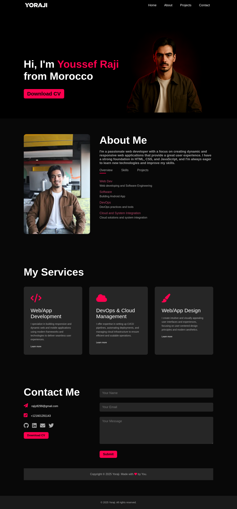

# Yoraji Portfolio

A modern, responsive personal portfolio website showcasing web development skills and services.

## 📋 Project Overview

This is a single-page portfolio website built with vanilla HTML, CSS, and JavaScript. It features a clean, dark theme with smooth animations and responsive design.

## 🚀 Features

- **Responsive Design**: Works seamlessly across desktop, tablet, and mobile devices
- **Interactive Navigation**: Smooth scrolling navigation with hover effects
- **Tabbed About Section**: Dynamic content switching between Overview, Skills, and Projects
- **Services Showcase**: Grid layout highlighting development services
- **Contact Form**: Functional contact form with social media links
- **Modern UI**: Dark theme with accent colors and smooth transitions

## 🛠️ Technologies Used

- **HTML5**: Semantic markup and structure
- **CSS3**: Custom styling with flexbox, grid, and animations
- **JavaScript**: Interactive tab functionality
- **Font Awesome**: Icons for services and contact information

## 📁 Project Structure

```
My_portfolio/
├── index.html          # Main HTML file
├── style.css           # CSS styles and responsive design
├── readme.md           # Project documentation
└── img/               # Image assets
    ├── hero.png       # Hero section image
    ├── Logo.png       # Navigation logo
    ├── yoraji.png     # About section profile image
    └── screencapture-127-0-0-1-5500-index-html-2025-07-21-23_59_02.png # Live demo screenshot
```

## 🎨 Sections

- **Header/Hero**: Introduction with name and call-to-action
- **About**: Personal information with tabbed content (Overview, Skills, Projects)
- **Services**: Three main service offerings with icons and descriptions
- **Contact**: Contact information and form with social media links

## 🖥️ Live Demo



## 🚀 Getting Started

1. Clone or download the repository
2. Open [`index.html`](index.html) in your web browser
3. Or serve it using a local development server:
   ```bash
   # Using Python 3
   python -m http.server 5500
   
   # Using Node.js (if you have live-server installed)
   live-server
   ```

## 📱 Responsive Breakpoints

- **Desktop**: 1024px and above
- **Tablet**: 768px - 1023px  
- **Mobile**: Below 768px

## 🎯 Key Features

- **Interactive Tabs**: JavaScript-powered content switching in the About section
- **Hover Effects**: Smooth transitions on navigation, buttons, and service cards
- **Form Validation**: Required fields for contact form
- **Social Integration**: Links to GitHub, LinkedIn, email, and Twitter

## 🔧 Customization

To customize the portfolio for your own use:

1. Update personal information in [`index.html`](index.html)
2. Replace images in the `img/` folder
3. Modify colors and styling in [`style.css`](style.css)
4. Update contact information and social media links

## 📞 Contact

- **Email**: rajiy8299@gmail.com
- **Phone**: +121601291143
- **Location**: Morocco

## 🌟 Services Offered

1. **Web/App Development**: Building responsive and dynamic applications
2. **DevOps & Cloud Management**: CI/CD pipelines and cloud infrastructure
3. **Web/App Design**: User-centered design and modern aesthetics

## 📄 License

This project is open source and available under the MIT License.

---

*Made with ❤️ by Youssef Raji (Yoraji)*